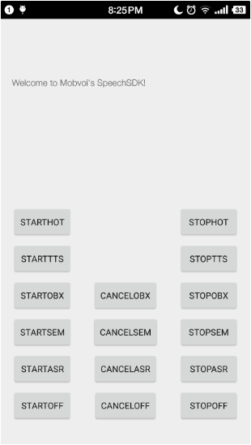
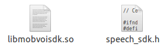

问问语音SDK集成指南
===============================================
- [摘要](#intro)
- [安装](#installation)
    - [Android版本](#android)
    - [Linux版本](#linux)

## [摘要](#intro)
本文档提供一个step by step的SDK简易集成步骤

### [Android版本](#android)
> **注意** 以下步骤均基于Linux+Android Studio平台  
> 其他平台均可类似参考
    
官网下载[Anroid版](http://ai.chumenwenwen.com/pages/document/intro?id=download)语音SDK. SDK格式如：*speechsdk-{level}-{version}.zip*
```bash
.
|-- speechsdk-lite-1.02-1493367839218.zip     -> 轻量版
|-- speechsdk-mini-1.02-1493367956288.zip     -> 超轻量版
`-- speechsdk-normal-1.02-1493367741941.zip   -> 全量版
```

以全量版(*-normal-*)为例,解压到指定目录
```shell
$ cp ~/Downloads/speechsdk-normal-XXX.zip ${workspace}
$ cd ${workspace}
$ unzip Speechsdk-XXX.zip
```
全量版SDK本身是一个gradle项目,含aar包以及两个Demo工程  
目录结构如下:
```bash
|-- build.gradle                     -> 全局构建
|-- demo                             -> 一个全量的demo
|   ...
|   |-- build.gradle
|   `-- src
|-- gradle
|   `-- wrapper
|-- gradle.properties
|-- gradlew
|-- gradlew.bat
|-- local.properties
|-- robot                            -> 问问机器人demo
|-- settings.gradle        
|   ...
|   |-- build.gradle
|   `-- src
|-- settings.gradle
|-- SpeechSDKDemo.iml
`-- SpeechSDKLib                     -> SDK library
    |-- build.gradle
    |-- SpeechSDKLib.iml
    `-- SpeechSDK-release.aar

```
> 注: 轻量版和超轻量版中仅demo工程略有区别

Android Studio导入整个gradle项目

  

测试demo或者robot工程  


开发者自行创建工程，导入speech
 - 导入SpeechSDKLib下的库
 - 导入speechsdk依赖的第三方库  


### Linux版本
仅需引用speech_sdk.h头文件，编译时链接上libmobvoisdk.so即可。 



